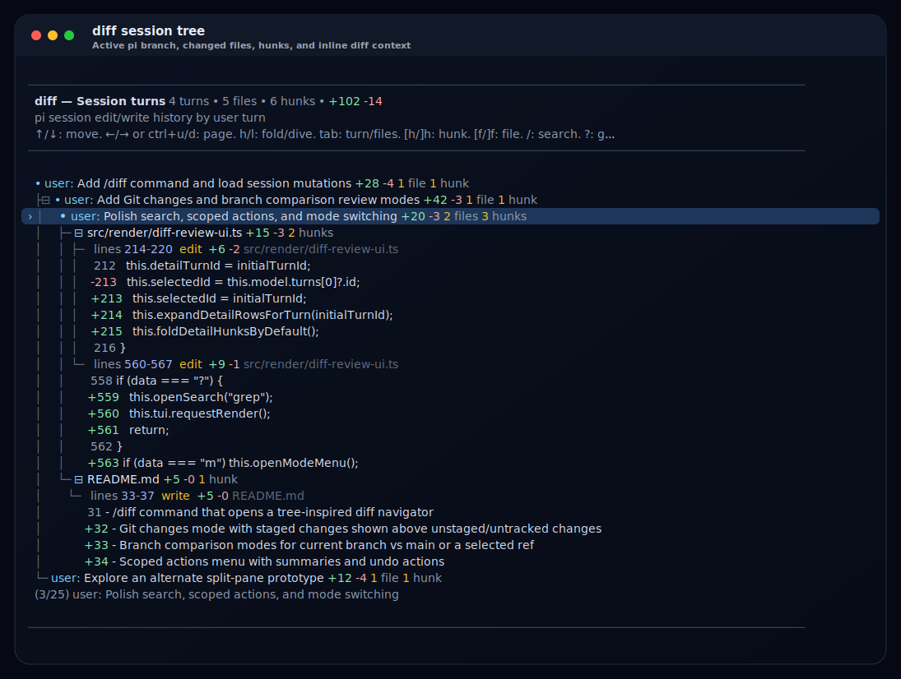
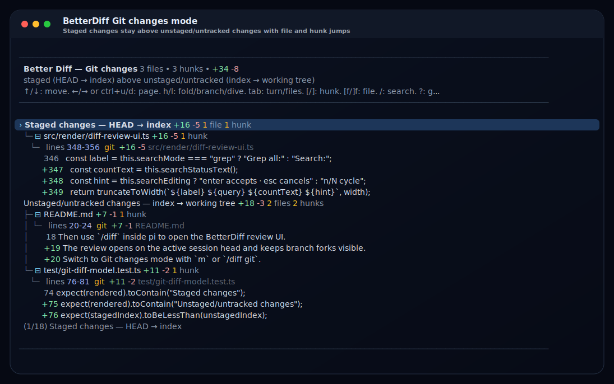
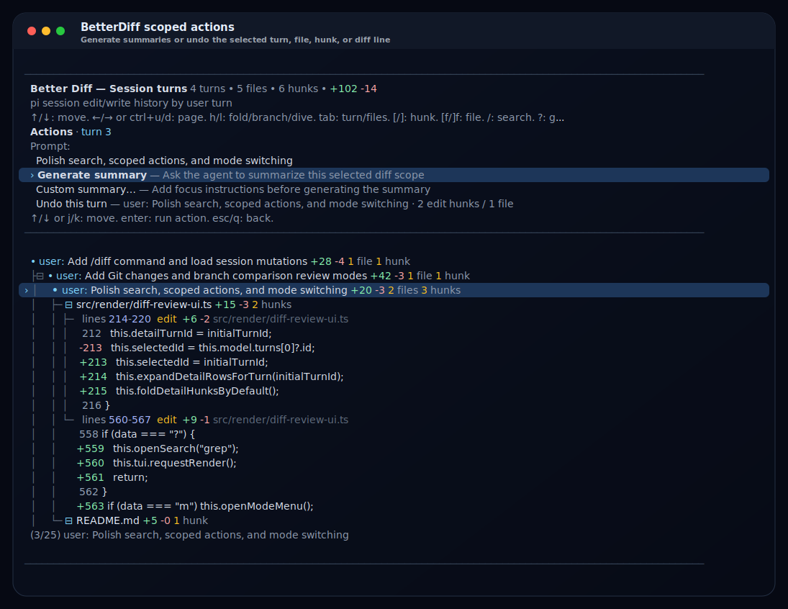

# pi-diff

A [pi](https://pi.dev) extension package focused on better session-diff ergonomics.

The extension now includes an initial `/diff` UI prototype for reviewing agent-produced `edit` and `write` mutations across the current pi session tree, plus practical Git changes and branch comparison modes.



<p>
  
  
</p>

## Install

Install from npm:

```bash
pi install npm:pi-diff
```

Install directly from GitHub:

```bash
pi install git:github.com/phongndo/pi-diff
```

Install a pinned GitHub release/tag:

```bash
pi install git:github.com/phongndo/pi-diff@v0.1.0
```

Try without installing:

```bash
pi -e .
```

Then use `/diff` inside pi to open the pi-diff review UI.

## What is included

- TypeScript-based pi extension package layout
- strict TypeScript config for editor/LSP-friendly checks
- ESLint + Prettier setup
- **Vitest** test suite with coverage support
- GitHub Actions for CI and release packaging
- `/diff` command that opens a tree-inspired diff navigator
- default session-turn mode for reviewing agent-produced `edit`/`write` mutations by user turn
- combined Git changes mode backed by `git diff --cached`, `git diff`, and untracked-file patches, with staged changes shown above unstaged/untracked changes
- branch comparison modes for current branch vs main/master and current branch vs a selected branch/ref
- in-UI mode switching with `m`, plus `/diff git`, `/diff changes`, `/diff branch`, and `/diff branch <base-ref>` shortcuts
- branch-aware tree of diff-producing user turns that opens on the active session head, stays flat for linear history, indents only at forks, and marks the active branch
- branch-aware turn navigator with locally nested file sections, `@@` hunk headers, and syntax-highlighted diff lines for the selected turn, plus file jumps via `[f` / `]f`
- visible-row search with `/`, plus all-review grep with `?`; cycle matches via `n` / `N`
- `enter` scoped actions menu with summaries and undo actions for the selected turn/file/hunk/diff line
- `ctrl+g` external-editor handoff for the selected diff hunk

## Repo layout

```text
.
├── .github/workflows/   # CI + release automation
├── docs/plan.md         # scaffold and implementation plan
├── docs/screenshots/    # README screenshot assets
├── src/
│   ├── config/          # placeholder for future config modules
│   ├── diff/            # placeholder for future diff logic
│   ├── render/          # custom TUI diff-review component
│   ├── runtime/         # placeholder for future runtime orchestration
│   └── index.ts         # pi extension entrypoint and /diff command
└── test/
    └── fixtures/        # placeholder golden/regression fixtures
```

## Local development

```bash
npm install
npm run check
```

### Load it in pi

```bash
pi -e .
```

Then use `/diff` inside pi to open the diff review UI. Use `m` inside the UI to switch between Session turns, Git changes, and branch comparisons; `/diff git` opens the combined Git view, `/diff branch` compares the current branch to main/master, and `/diff branch <base-ref>` compares the current branch against a selected base.

## Scripts

- `npm run format` — format the repo
- `npm run format:check` — verify formatting
- `npm run lint` — run type-aware linting
- `npm run typecheck` — run TypeScript no-emit checks
- `npm run test` — run the Vitest suite
- `npm run test:coverage` — run Vitest with coverage
- `npm run check` — run formatting, lint, type, and test checks
- `npm run pack:check` — verify the package can be packed cleanly
- `npm run ci` — local CI-equivalent pipeline
- `npm run dev:pi` — load the package directly into pi

## CI/CD

### CI

`.github/workflows/ci.yml` runs on pull requests and pushes to `main`.
It installs dependencies, runs the full quality pipeline, and verifies that `npm pack` succeeds.

### CD

`.github/workflows/release.yml` runs on `v*` tags and on manual dispatch.
It re-validates the package, creates a tarball with `npm pack`, uploads it as a workflow artifact, and attaches it to a GitHub release when triggered by a tag.

Tagged releases publish to npm when `NPM_TOKEN` is configured; otherwise the workflow still builds and attaches the package tarball.

## Next steps

Next work should deepen the prototype: richer write/overwrite diffs, broader branch/ref comparison controls, better tests for renderer output, and more editor adapters.
